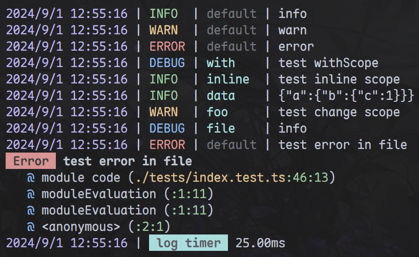

## consoloo

customable colorful logger for nodejs and browser




### install

```shell
npm install consoloo
```

```shell
yarn add consoloo
```

```shell
pnpm add consoloo
```

### usage

```ts
import { createFileReporter, createNodeLogger } from 'consoloo'
import { createBrowserLogger } from 'consoloo/browser'
import { createBaseLogger } from 'consoloo/core'

// basic
const logger = createBaseLogger()

// node
const node = createNodeLogger()
const stop = node.timer('log timer')
node.info('info')
node.warn('warn')
node.error('error')
node.setLogMode('debug')
node.withScope('with').debug('test withScope')
node.info('test inline scope', 'inline')
const scopeLogger = node.withScope('foo')
scopeLogger.warn('test change scope')

const fileLogger = createNodeLogger<'file' | 'test'>({
  logMode: 'debug',
  reporter: [createFileReporter({ logDir: './logs' })],
})
fileLogger.debug('info', 'file') // typesafe scope
try {
  throw new Error('test error in file')
} catch (error) {
  fileLogger.error('test error in file', error)
}
stop()

// browser
const browserLogger = createBrowserLogger('debug')
```

#### logMode

- `'debug'`: debug, info, warn, error
- `'info'`: info, warn, error
- `'error'`: error
- `'disable'`: none
